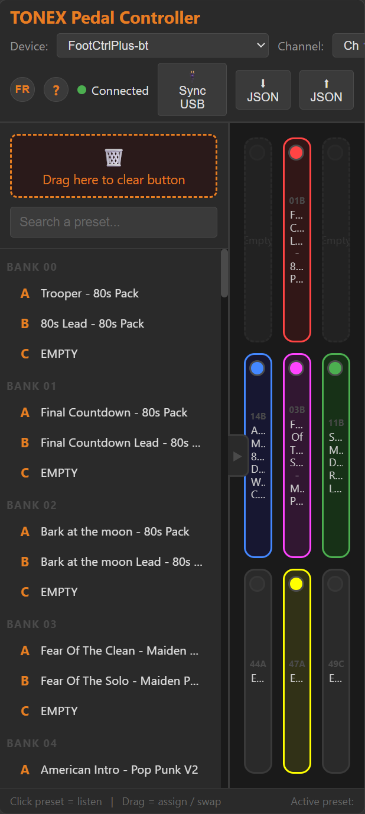
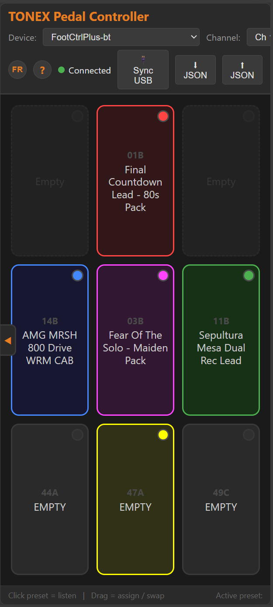

# TONEX Pedal Controller

Single-page web controller for the IK Multimedia TONEX Pedal. Manages presets via USB MIDI and BLE MIDI, and reads names/configurations directly from the pedal via the USB CDC serial interface.

Computer:


Android smartphone:




Computer demo video:
[](https://www.youtube.com/watch?v=ZrpM73ms7fk)

Android demo vido:
[](https://www.youtube.com/watch?v=XhKJ70A9dGQ)

## Features

- **3×3 Grid** of assignable presets with names
- **Preset colors** — assign one of 9 LED colors (red, green, amber, yellow, cyan, blue, pink, purple, white) to each tile
- **Full library** of 150 presets (50 banks × 3 slots A/B/C)
- **USB Sync** — reads all names directly from the pedal
- **MIDI Control** — sends Bank Select + Program Change to change presets
- **BLE MIDI Control** — experimental Web Bluetooth route for the same preset mapping path, using a custom GATT service/characteristic and the same Bank Select + Program Change semantics when the BLE packet is accepted by the pedal
- **Drag & drop** — assign a preset to a button, swap between buttons, or delete via trash
- **Editing** — double-click to rename a preset
- **Search** — filtering in the library
- **Persistence** — configuration saved in localStorage
- **Responsive** — adaptive text via `container-type: inline-size` + `cqi` units
- **Library toggle** — discreet chevron to minimize/expand the preset library
- **Export/Import JSON** — export preset names, grid assignments and colors to a file, import on another setup
- **Android support** — works on Android Chrome via WebUSB fallback (Web Serial not available on Android)

## Prerequisites

| Component | Required version |
|-----------|-----------------|
| Browser | Chrome 89+ or Edge 89+ (Web MIDI + Web Serial API + Web Bluetooth BLE MIDI support) |
| OS | Windows 10/11, Android (via WebUSB) |
| Pedal | IK Multimedia TONEX Pedal (full size) |
| Cable | USB-C connected to the pedal's USB port |
| BLE | BLE MIDI requires a secure origin such as localhost/HTTPS and a Web Bluetooth-enabled device/browser. The selected device must expose the known service UUID `03b80e5a-ede8-4b33-a751-6ce34ec4c700` and characteristic `7772e5db-3868-4112-a1a9-f2669d106bf3` |

> **Note**: On Android, Web Serial is not available — the app falls back to WebUSB for USB CDC communication. MIDI is not available on Android (no Web MIDI API).

## Installation

### Option 1 — Local web server (recommended)

Copy the `tonexpedal/` folder to your web server root, then access via:
```
https://your-server/tonexpedal/
```

### Option 2 — localhost with a simple server

```bash
# From the tonexpedal/ folder
npx serve -s . -l 3000
# or
python -m http.server 3000
```

Then open `http://localhost:3000`.

### Option 3 — Static file (no server required)

Simply double-click `index.html` or open it via `file:///` in your browser.

## Usage

### MIDI Connection

The application supports two distinct preset-control transports:

1. **USB MIDI / Web MIDI**: a classic Web MIDI route over the pedal's USB-MIDI class device. It remains the default and most stable transport for Bank Select + Program Change.
2. **BLE MIDI**: an experimental Web Bluetooth route that scans for a TONEX-compatible GATT service using the registered MIDI characteristic. It mirrors the same Bank Select + Program Change model, but it is not wired to the same data flow as the USB transport and is intentionally treated as an experimental branch.

The BLE route is selected by the application from the device picker in the same UI and it emits the same logical Bank Select + Program Change semantics as the USB MIDI branch, but the underlying packet frame is a BLE GATT write wrapped in the custom MIDI packet assembly used by the app.

1. Connect the TONEX Pedal via USB
2. Open the app in Chrome/Edge
3. Select the MIDI device in the **Device** dropdown, or run the BLE search flow if the device is advertised through Web Bluetooth
4. Choose the MIDI channel (default: Ch 1)
5. Status changes to **Connected** (green dot)

> **BLE MIDI support note**: the BLE route is experimental and may disconnect rapidly on some host hardware or browser state. On the current branch it also remains a known limitation that the upper preset window `42C..49C` (`pc = 128..149`) does not yet map reliably. It can fall back to the `00A` range or the wrong bank/slot selection on the pedal. The BLE route for `>= 42C` is therefore documented as incomplete and non-stable.

### USB Sync (reading presets)

1. Click **Sync USB**
2. Select the TONEX Pedal serial port in the dialog
3. Progress shows: Hello → State → Reading 150 presets
4. Names fill in automatically
5. Button shows **Done! X/150 presets read**

### Export / Import JSON

- Click **⬇ JSON** to download preset names, grid assignments and colors as `tonex-config.json`
- Click **⬆ JSON** to import a previously exported file
  - **Old format** (preset names only): imports names directly
  - **New format** (v2 with grid config): prompts whether to restore grid assignments and colors

Export format (v2):
```json
{
  "version": 2,
  "presets": {
    "0_A": "Trooper - 80s Pack",
    "0_B": "80s Lead - 80s Pack"
  },
  "buttons": {
    "0": { "bank": 0, "slot": "A" },
    "4": { "bank": 1, "slot": "B" }
  },
  "colors": {
    "0": "red",
    "4": "blue"
  }
}
```

### 3×3 Grid

- **Single click** on a button → sends Bank Select + Program Change to the pedal
- **Drag** a preset from the library → assigns to the button
- **Drag** a button to another → swaps positions (colors swap too)
- **Drag** a button to the trash → clears the button and its color
- **Double-click** → opens edit modal (rename)
- **Color dot** (top-right corner) → click to assign a LED color to the tile

### Library

- **Single click** → sends MIDI to audition the preset
- **Double-click** → edits name
- **Search** → filters by name or bank/slot number
- **Drag** to grid → assigns the preset
- **Chevron toggle** (▶/◀) on the panel border → minimizes/expands the library

## Technical Architecture

### Files

```
tonexpedal/
├── index.html          # Single-file application (HTML + CSS + JS)
├── favicon.svg         # SVG icon
├── README.md           # This documentation
├── docs/
│   └── index.html      # Web documentation page (FR/EN)
├── captures/
│   └── tnx1.png        # Interface screenshot
└── V1.0/
    └── index.html      # Version 1.0 archive
```

### MIDI Protocol

The TONEX Pedal uses 50 banks × 3 slots (A/B/C) = 150 presets.

| Preset # | Bank Select (CC#0) | Program Change |
|----------|-------------------|----------------|
| 0–127    | CC#0 = 0          | PC = preset#   |
| 128–149  | CC#0 = 1          | PC = preset# − 128 |

```
Bank Select:    [0xB0 + channel, 0x00, value]
Program Change: [0xC0 + channel, PC]
```

### USB CDC Serial Protocol (HDLC)

The pedal exposes two USB interfaces:
- **USB-MIDI** — for Bank Select / Program Change over Web MIDI / USB-MIDI transport
- **USB CDC** — for serial communication (reading presets, parameters)

### BLE MIDI transport — architecture and packet framing

The BLE path is deliberately separated from the USB path and is therefore an additional transport that the app can discover through `navigator.bluetooth.requestDevice()` and a device filter for the BLE service `03b80e5a-ede8-4b33-a751-6ce34ec4c700` and characteristic `7772e5db-3868-4112-a1a9-f2669d106bf3`.

The application uses the same high-level preset abstraction (`bank` and `slot`) and converts it to a `pc` number through the classic formula:

```
pc = bank × 3 + slotIndex
```

For the USB / Web MIDI flow, the transport semantics are:

```
[0xB0 + channel, 0x00, 0]  -> CC#0 Bank Select for the first bank
[0xC0 + channel, PC]      -> Program Change payload
```

For the BLE transport the code assembles a consolidated GATT write packet following the Apple BLE MIDI spec:

```
[0x80, 0x80, midiCh, 0, bankVal, 0x80, 0xC0 + ch, pcVal]
```

BLE MIDI packet framing:

- `0x80` — packet header (timestamp MSB)
- `0x80` — delta-time for CC#0 message (delta = 0)
- `midiCh` — CC status byte (`0xB0 + channel`)
- `0` — controller number (CC#0 = Bank Select MSB)
- `bankVal` — `0` for pc 0..127, `1` for pc 128..149
- `0x80` — delta-time for PC message (delta = 0)
- `0xC0 + ch` — Program Change status byte
- `pcVal` — `pc` for 0..127, `pc - 128` for 128..149

Each MIDI message in a BLE packet must be preceded by a delta-time byte (bit 7 set). Without the explicit `0x80` delta-time before `midiCh`, the parser interprets `midiCh` (0xB0+ch, bit 7 set) as a delta-time byte and silently drops the entire Bank Select — the PC then falls back to the default bank page 0.

The transport distinction is therefore:

- **USB-MIDI path**: Browser Web MIDI -> USB-MIDI device -> TONEX Pedal
- **BLE MIDI path**: Browser Web Bluetooth -> custom GATT service/characteristic -> TONEX Pedal

The BLE route is not a second USB device interface. It is a separate GATT channel that carries the same logical MIDI message but routes through a different public API and a different packet envelope.

#### HDLC Frame

```
[0x7E] [payload stuffed] [CRC_lo stuffed] [CRC_hi stuffed] [0x7E]
```

- **Delimiter**: `0x7E`
- **Byte stuffing**: `0x7E` → `0x7D 0x5E`, `0x7D` → `0x7D 0x5D`
- **CRC-CCITT**: polynomial `0x8408`, init `0xFFFF`, inverted result (`~crc & 0xFFFF`)

#### Commands

| Command | Payload | Description |
|---------|---------|-------------|
| Hello | `b9 03 00 82 04 00 80 10 01 b9 02 02 10` | Connection init |
| Request State | `b9 03 00 82 06 00 80 10 03 b9 02 81 01 02 10` | Request current state |
| Request Preset (0–127) | `b9 03 81 00 02 82 06 00 80 10 03 b9 04 10 01 [index] 00` | Request preset (17 bytes) |
| Request Preset (128+) | `b9 03 81 00 02 82 06 00 80 10 03 b9 04 10 01 80 [index] 00` | Request preset (18 bytes, escape `0x80`) |

#### Preset Response — Structure

```
[header] [B9 04 B9 02 BC 21] [name 33 bytes] [parameters...]
                                          ↑ NAME_MARKER
```

The parameters section starts with marker `BA 03 BA 6D` (`PARAM_MARKER`), followed by encoded floats `0x88` + 4 bytes (little-endian):

| Parameter index | Byte offset (×5) | Description |
|----------------|-------------------|-------------|
| 17 | 85 | **AMP Enable** — 0.0 = off, >0.5 = on |
| 22 | 110 | **CAB Type** — 0.0 = off, 1.0 = VIR, 2.0 = Tone Model |

### Device ID

- **TONEX Pedal (full size)**: `0x10`
- TONEX One: `0x0B` (not supported)

### Transport Abstraction (Android Support)

The app uses a transport abstraction layer to support both **Web Serial** (desktop) and **WebUSB** (Android):

```
transportSend(frame)      → Serial.write() or USB.bulkTransferOut()
transportStartRead()      → Serial reader loop or USB.bulkTransferIn() loop
transportIsOpen()         → serialPort.opened or usbDevice.opened
transportDisconnect()     → serialPort.close() or usbDevice.close()
```

**Connection flow:**
1. Try **Web Serial** first (desktop Chrome/Edge)
2. If unavailable or fails, fallback to **WebUSB** (Android Chrome)
3. WebUSB shows the device picker filtered by VID `0x1963` (IK Multimedia)

**WebUSB CDC setup:**
- Find CDC Communication interface (class `0x02`) → control transfers (SET_LINE_CODING, SET_CONTROL_LINE_STATE)
- Find CDC Data interface (class `0x0A`) → bulk endpoints for HDLC data
- If class `0x0A` not found, fallback to any interface with bulk endpoints

### Persistence

Everything is saved in `localStorage` under the key `tonex-state`:

```json
{
  "buttons": {
    "0": { "bank": 0, "slot": "A" },
    "4": { "bank": 1, "slot": "B" }
  },
  "midi": { "device": "ToneX MIDI Out", "channel": 0 },
  "presets": {
    "0_A": { "name": "Trooper - 80s Pack", "amp": true, "cab": false },
    "0_B": { "name": "80s Lead - 80s Pack", "amp": true, "cab": true }
  },
  "colors": {
    "0": "red",
    "4": "blue"
  }
}
```

## Troubleshooting

| Problem | Solution |
|---------|----------|
| No MIDI device | Check USB connection. Chrome → `chrome://midi-devices` |
| Web Serial unavailable | Use Chrome 89+ or Edge 89+. Check HTTPS/localhost |
| USB Sync fails | Close IK Tonex and any app using the serial port |
| Names don't appear | Re-run Sync USB. Check console (F12) for errors |
| AMP/CAB always grey | Check console for correct float32 values (log for first 3 presets) |
| Blank page after load | Reload the page, localStorage may be corrupted |
| Android: Sync doesn't read data | WebUSB fallback should auto-activate. Check console for interface/endpoint logs |

## Credits

- USB CDC protocol: reverse-engineered from [Builty/TonexOneController](https://github.com/Builty/TonexOneController)
- Protocol documentation: [vit3k/tonex_controller](https://github.com/vit3k/tonex_controller)
- Interface: IK Multimedia TONEX Pedal Controller v1.1

## License

Personal project — non-commercial use.
