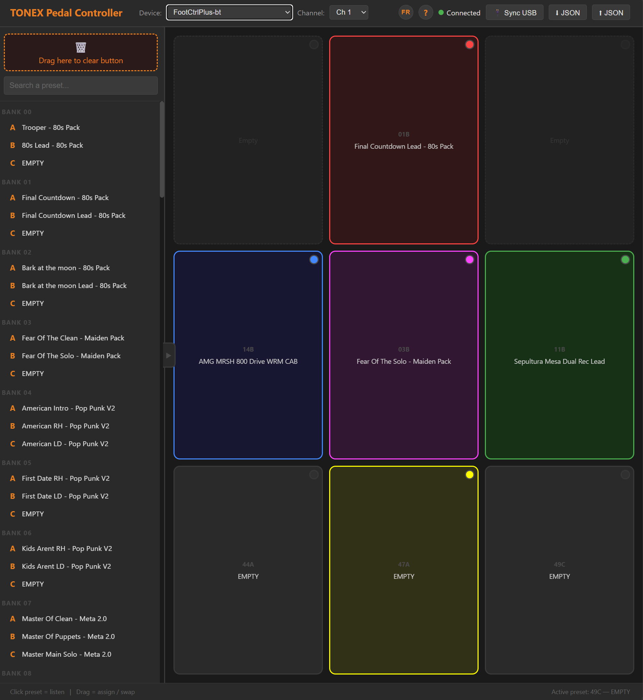

# TONEX Pedal Controller

Contrôleur web single-page pour l'IK Multimedia TONEX Pedal. Gère les presets via USB MIDI et lit les noms/configurations directement depuis le pédalier via l'interface série USB CDC.



## Fonctionnalités

- **Grille 3×3** de presets assignables avec noms et badges AMP/CAB
- **Bibliothèque complète** des 150 presets (50 banks × 3 slots A/B/C)
- **Synchronisation USB** — lecture de tous les noms et flags AMP/CAB directement depuis le pédalier
- **Contrôle MIDI** — envoi de Bank Select + Program Change pour changer de preset
- **Glisser-déposer** — assigner un preset à un bouton, swap entre boutons, ou supprimer via la corbeille
- **Édition** — double-clic pour renommer un preset et toggler AMP/CAB
- **Recherche** filtrante dans la bibliothèque
- **Persistance** — configuration sauvegardée en localStorage
- **Responsive** — texte adaptatif via `container-type: inline-size` + unités `cqi`

- **Export/Import JSON** — exporte les noms de presets vers un fichier, importe sur une autre config

## Prérequis

| Composant | Version requise |
|-----------|----------------|
| Navigateur | Chrome 89+ ou Edge 89+ (Web MIDI + Web Serial API) |
| Système | Windows 10/11 |
| Pédalier | IK Multimedia TONEX Pedal (full size) |
| Câble | USB-C connecté au port USB du pédalier |

> **Note** : L'API Web Serial nécessite HTTPS ou localhost. Servir via un serveur web local (ex: `https://mon-serveur/tonexpedal/`) ou `localhost`.

## Installation

### Option 1 — Serveur web local (recommandé)

Copier le dossier `tonexpedal/` dans le répertoire racine de votre serveur web, puis accéder via :
```
https://mon-serveur/tonexpedal/
```

### Option 2 — localhost avec un serveur simple

```bash
# Depuis le dossier tonexpedal/
npx serve -s . -l 3000
# ou
python -m http.server 3000
```

Puis ouvrir `http://localhost:3000`.

### Option 3 — Fichier statique (sans serveur)

Simplement double-cliquer sur `index.html` ou l'ouvrir via `file:///` dans votre navigateur.

## Utilisation

### Connexion MIDI

1. Brancher le TONEX Pedal en USB
2. Ouvrir l'application dans Chrome/Edge
3. Sélectionner le device MIDI dans le menu déroulant **Device**
4. Choisir le canal MIDI (défaut : Ch 1)
5. Le statut passe à **Connecté** (point vert)

### Synchronisation USB (lecture des presets)

1. Cliquer sur **Sync USB**
2. Sélectionner le port série TONEX Pedal dans le dialog
3. La progression s'affiche : Hello → State → Lecture des 150 presets
4. Les noms et badges AMP/CAB se remplissent automatiquement
5. Le bouton affiche **Terminé! X/150 presets lus**

### Export / Import JSON

- Cliquer sur **⬇ JSON** pour télécharger les noms de presets en `tonex-presets.json`
- Cliquer sur **⬆ JSON** pour importer un fichier exporté (valide le format, remplace les noms)

Format JSON :
```json
{
  "0_A": "Trooper - 80s Pack",
  "0_B": "80s Lead - 80s Pack",
  "1_A": "Final Countdown - 80s Pack"
}
```

### Grille 3×3

- **Clic simple** sur un bouton → envoie le Bank Select + Program Change au pédalier
- **Glisser** un preset de la bibliothèque → assigne au bouton
- **Glisser** un bouton vers un autre → swap les positions
- **Glisser** un bouton vers la corbeille → vide le bouton
- **Double-clic** → ouvre le modal d'édition (nom, AMP, CAB)

### Bibliothèque

- **Clic simple** → envoie le MIDI pour écouter le preset
- **Double-clic** → édite le nom et les flags AMP/CAB
- **Recherche** → filtre par nom ou numéro de bank/slot
- **Glisser** vers la grille → assigne le preset

## Architecture technique

### Fichiers

```
tonexpedal/
├── index.html          # Application single-file (HTML + CSS + JS)
├── favicon.svg         # Icône SVG
├── README.md           # Cette documentation
├── captures/
│   └── tnx1.png        # Capture d'écran de l'interface
└── V1.0/
    └── index.html      # Archive de la version 1.0
```

### Protocole MIDI

Le TONEX Pedal utilise 50 banks × 3 slots (A/B/C) = 150 presets.

| Preset # | Bank Select (CC#0) | Program Change |
|----------|-------------------|----------------|
| 0–127    | CC#0 = 0          | PC = preset#   |
| 128–149  | CC#0 = 1          | PC = preset# − 128 |

```
Bank Select : [0xB0 + channel, 0x00, value]
Program Change : [0xC0 + channel, PC]
```

### Protocole USB CDC Série (HDLC)

Le pédalier expose deux interfaces USB :
- **USB-MIDI** — pour les Bank Select / Program Change
- **USB CDC** — pour la communication série (lecture presets, paramètres)

#### Trame HDLC

```
[0x7E] [payload stuffed] [CRC_lo stuffed] [CRC_hi stuffed] [0x7E]
```

- **Délimiteur** : `0x7E`
- **Byte stuffing** : `0x7E` → `0x7D 0x5E`, `0x7D` → `0x7D 0x5D`
- **CRC-CCITT** : polynomial `0x8408`, init `0xFFFF`, résultat inversé (`~crc & 0xFFFF`)

#### Commandes

| Commande | Payload | Description |
|----------|---------|-------------|
| Hello | `b9 03 00 82 04 00 80 10 01 b9 02 02 10` | Initialisation connexion |
| Request State | `b9 03 00 82 06 00 80 10 03 b9 02 81 01 02 10` | Demande l'état courant |
| Request Preset (0–127) | `b9 03 81 00 02 82 06 00 80 10 03 b9 04 10 01 [index] 00` | Demande preset (17 octets) |
| Request Preset (128+) | `b9 03 81 00 02 82 06 00 80 10 03 b9 04 10 01 80 [index] 00` | Demande preset (18 octets, escape `0x80`) |

#### Réponse preset — Structure

```
[header] [B9 04 B9 02 BC 21] [nom 33 octets] [paramètres...]
                                           ↑ NAME_MARKER
```

La section paramètres commence par le marker `BA 03 BA 6D` (`PARAM_MARKER`), suivi de floats encodés `0x88` + 4 octets (little-endian) :

| Index paramètre | Octet offset (×5) | Description |
|----------------|-------------------|-------------|
| 17 | 85 | **AMP Enable** — 0.0 = off, >0.5 = on |
| 22 | 110 | **CAB Type** — 0.0 = off, 1.0 = VIR, 2.0 = Tone Model |

### Device ID

- **TONEX Pedal (full size)** : `0x10`
- TONEX One : `0x0B` (non supporté)

### Persistance

Tout est sauvegardé en `localStorage` sous la clé `tonex-state` :

```json
{
  "buttons": {
    "0": { "bank": 0, "slot": "A" },
    "4": { "bank": 1, "slot": "B" }
  },
  "midi": { "device": "ToneX MIDI Out", "channel": 0 },
  "presets": {
    "0_A": { "name": "Trooper - 80s Pack", "amp": true, "cab": false },
    "0_B": { "name": "80s Lead - 80s Pack", "amp": true, "cab": true }
  }
}
```

## Dépannage

| Problème | Solution |
|----------|----------|
| Aucun device MIDI | Vérifier que le pédalier est branché. Chrome → `chrome://midi-devices` |
| Web Serial non disponible | Utiliser Chrome 89+ ou Edge 89+. Vérifier HTTPS/localhost |
| Sync USB échoue | Fermer tout autre logiciel utilisant le port série (IK Tonex, etc.) |
| Noms ne s'affichent pas | Relancer le Sync USB. Vérifier la console (F12) pour les erreurs |
| AMP/CAB toujours gris | Vérifier dans la console que les float32 sont correctement lus |
| Canvas vide | Recharger la page, le localStorage peut être corrompu |

## Crédits

- Protocole USB CDC : reverse-engineered depuis [Builty/usb_tonex_one](https://github.com/Builty/usb_tonex_one)
- Documentation protocole : [vit3k/tonex-one-js](https://github.com/vit3k/tonex-one-js)
- Interface : IK Multimedia TONEX Pedal Controller v1.1

## Licence

Projet personnel — usage non commercial.
