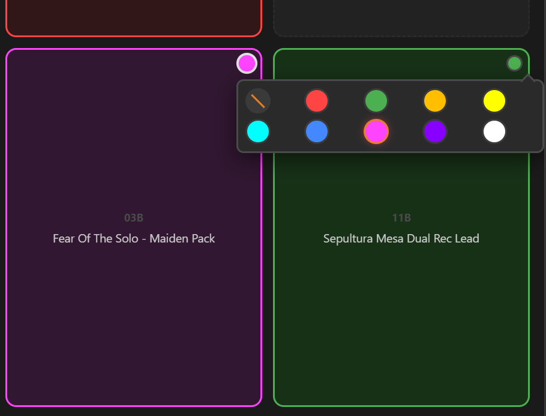

# TONEX Pedal Controller

Contrôleur web single-page pour l'IK Multimedia TONEX Pedal. Gère les presets via USB MIDI et BLE MIDI, et lit les noms/configurations directement depuis le pédalier via l'interface série USB CDC.

Ordinateur :


Téléphone Android :


Démo vidéo PC :
[](https://www.youtube.com/watch?v=ZrpM73ms7fk)

Démo vidéo Android :
[](https://www.youtube.com/watch?v=XhKJ70A9dGQ)

## Fonctionnalités

- **Grille 3×3** de presets assignables avec noms
- **Couleurs de presets** — assigner l'une des 9 couleurs LED (rouge, vert, ambre, jaune, cyan, bleu, rose, violet, blanc) à chaque tuile
- **Bibliothèque complète** des 150 presets (50 banks × 3 slots A/B/C)
- **Synchronisation USB** — lecture de tous les noms directement depuis le pédalier
- **Contrôle MIDI** — envoi de Bank Select + Program Change pour changer de preset
- **Contrôle BLE MIDI** — route Web Bluetooth expérimentale pour la même logique de preset, basée sur un service GATT et une caractéristique personnalisée, avec le même schéma logique Bank Select + Program Change quand le paquet BLE est accepté par le pédalier
- **Glisser-déposer** — assigner un preset à un bouton, swap entre boutons, ou supprimer via la corbeille
- **Édition** — double-clic pour renommer un preset
- **Recherche** filtrante dans la bibliothèque
- **Persistance** — configuration sauvegardée en localStorage
- **Responsive** — texte adaptatif via `container-type: inline-size` + unités `cqi`
- **Bascule bibliothèque** — chevron discret pour minimiser/étendre la bibliothèque de presets
- **Export/Import JSON** — exporte les noms de presets, les assignations de grille et les couleurs vers un fichier, importe sur une autre config
- **Support Android** — fonctionne sur Android Chrome via fallback WebUSB (Web Serial non disponible sur Android)

## Prérequis

| Composant | Version requise |
|-----------|----------------|
| Navigateur | Chrome 89+ ou Edge 89+ (Web MIDI + Web Serial API + Web Bluetooth BLE MIDI) |
| Système | Windows 10/11, Android (via WebUSB) |
| Pédalier | IK Multimedia TONEX Pedal (full size) |
| Câble | USB-C connecté au port USB du pédalier |
| BLE | La couche BLE MIDI nécessite une origine sécurisée telle que localhost/HTTPS et un navigateur compatible Web Bluetooth. Le device sélectionné doit exposer le service `03b80e5a-ede8-4b33-a751-6ce34ec4c700` et la caractéristique `7772e5db-3868-4112-a1a9-f2669d106bf3` |

> **Note** : L'API Web Serial nécessite HTTPS ou localhost. Servir via un serveur web local (ex: `https://mon-serveur/tonexpedal/`) ou `localhost`.

> **Note Android** : Sur Android, Web Serial n'est pas disponible — l'application utilise le fallback WebUSB pour la communication USB CDC. Le MIDI n'est pas disponible sur Android (pas d'API Web MIDI).

## Installation

### Option 1 — Serveur web local (recommandé)

Copier le dossier `tonexpedal/` dans le répertoire racine de votre serveur web, puis accéder via :
```
https://mon-serveur/tonexpedal/
```

### Option 2 — localhost avec un serveur simple

```bash
# Depuis le dossier tonexpedal/
npx serve -s . -l 3000
# ou
python -m http.server 3000
```

Puis ouvrir `http://localhost:3000`.

### Option 3 — Fichier statique (sans serveur)

Simplement double-cliquer sur `index.html` ou l'ouvrir via `file:///` dans votre navigateur.

## Utilisation

### Connexion MIDI

L'application supporte deux transports de contrôle distincts :

1. **USB MIDI / Web MIDI** — route USB-MIDI classique, stable et prioritaire. Utilise le device USB-MIDI du pédalier pour le Bank Select + Program Change.
2. **BLE MIDI** — route Web Bluetooth utilisant un service GATT et caractéristique dédiée. Même sémantique Bank Select + Program Change que USB, mais trame de paquet différente (voir Architecture).

Pour se connecter :

1. Brancher le TONEX Pedal en USB-C
2. Ouvrir l'application dans Chrome/Edge
3. Sélectionner le device MIDI dans le menu déroulant **Device** (USB), ou cliquer sur **Scan BLE** pour chercher un device Bluetooth
4. Choisir le canal MIDI (défaut : Ch 1)
5. Le statut passe à **Connecté** (point vert)

> **Note** : sur Android, l'API Web MIDI n'est pas disponible. L'application utilise WebUSB pour la communication USB CDC et BLE MIDI pour le contrôle des presets.

### Synchronisation USB (lecture des presets)

La synchronisation lit les 150 noms de presets et leurs configurations AMP/CAB directement depuis le pédalier via l'interface série USB CDC. Cela nécessite la connexion USB CDC (port série), séparée de la connexion MIDI.

1. Cliquer sur **Sync USB**
2. Sélectionner le port série TONEX Pedal dans le dialog
3. L'application envoie une commande `HELLO`, lit l'état, puis charge les 150 presets
4. La barre de progression affiche l'avancement, les noms se remplissent automatiquement dans la bibliothèque
5. Le bouton affiche **Terminé! X/150 presets lus**
6. Chaque preset affiche son nom, le badge AMP (orange/vert/bleu) et le badge CAB (orange/vert/bleu) selon la configuration des paramètres

### Export / Import JSON

- Cliquer sur **⬇ JSON** pour télécharger les noms de presets, les assignations de grille et les couleurs en `tonex-config.json`
- Cliquer sur **⬆ JSON** pour importer un fichier exporté
  - **Ancien format** (noms de presets uniquement) : importe les noms directement
  - **Nouveau format** (v2 avec config grille) : demande si on veut restaurer les assignations et couleurs

Format d'export (v2) :
```json
{
  "version": 2,
  "presets": {
    "0_A": "Trooper - 80s Pack",
    "0_B": "80s Lead - 80s Pack"
  },
  "buttons": {
    "0": { "bank": 0, "slot": "A" },
    "4": { "bank": 1, "slot": "B" }
  },
  "colors": {
    "0": "red",
    "4": "blue"
  }
}
```

### Grille 3×3

La grille affiche 9 boutons de presets assignables, organisés en 3 lignes × 3 colonnes. Chaque bouton affiche son numéro bank/slot, le nom du preset et les badges AMP/CAB.



- **Clic simple** sur un bouton → envoie le Bank Select + Program Change au pédalier, le preset actif est mis en surbrillance
- **Glisser** un preset de la bibliothèque → assigne au bouton (nom, badges et couleur sont transférés)
- **Glisser** un bouton vers un autre → swap les positions (les couleurs et assignations suivent)
- **Glisser** un bouton vers la corbeille → vide le bouton et sa couleur
- **Double-clic** → ouvre le modal d'édition (renommage du preset)
- **Rond couleur** (coin supérieur droit) → cliquer pour assigner une des 9 couleurs LED (rouge, vert, ambre, jaune, cyan, bleu, rose, violet, blanc) à la tuile

### Bibliothèque

Le panneau bibliothèque liste les 150 presets (50 banks × 3 slots A/B/C) et s'affiche à gauche de l'écran sur PC, ou sur Android avec un bouton de réduction optionnel.

- **Clic simple** → envoie le MIDI pour écouter le preset (le charge sur le pédalier)
- **Double-clic** → édite le nom en ligne
- **Recherche** → filtre par nom ou numéro de bank/slot (ex. `42` affiche la bank 42, `42C` affiche le slot C de la bank 42)
- **Glisser** vers la grille → assigne le preset à un bouton
- **Chevron** (▶/◀) sur la bordure du panneau → minimise/étend la bibliothèque

La bibliothèque se réduit automatiquement lorsqu'un preset est assigné pour libérer de l'espace à l'écran.

## Architecture technique

### Fichiers

```
tonexpedal/
├── index.html          # Application single-file (HTML + CSS + JS)
├── favicon.svg         # Icône SVG
├── README.md           # Cette documentation
├── captures/
│   └── tnx1.png        # Capture d'écran de l'interface
└── V1.0/
    └── index.html      # Archive de la version 1.0
```

### Protocole MIDI

Le TONEX Pedal utilise 50 banks × 3 slots (A/B/C) = 150 presets.

| Preset # | Bank Select (CC#0) | Program Change |
|----------|-------------------|----------------|
| 0–127    | CC#0 = 0          | PC = preset#   |
| 128–149  | CC#0 = 1          | PC = preset# − 128 |

```
Bank Select : [0xB0 + channel, 0x00, value]
Program Change : [0xC0 + channel, PC]
```

### Protocole USB CDC Série (HDLC)

Le pédalier expose deux interfaces USB :
- **USB-MIDI** — pour les Bank Select / Program Change sur la route Web MIDI / USB-MIDI
- **USB CDC** — pour la communication série (lecture presets, paramètres)

### Transport BLE MIDI — architecture et trame

Le transport BLE est un chemin séparé et non réductible au flux USB. L’application ne construit pas un nouveau “midiOutput” d’USB, elle ouvre un canal GATT via `navigator.bluetooth.requestDevice()` puis accède au service `03b80e5a-ede8-4b33-a751-6ce34ec4c700` et à la caractéristique `7772e5db-3868-4112-a1a9-f2669d106bf3`.

La couche application manipule la table de presets dans un espace logique `bank × slot` converti ensuite en `pc` selon le calcul standard :

```
pc = bank × 3 + slotIndex
```

Pour le flux USB / Web MIDI, la sémantique de transport est bien connue :

```
[0xB0 + canal, 0x00, 0]  -> CC#0 Bank Select pour la première banque
[0xC0 + canal, PC]       -> Program Change
```

Pour le transport BLE, la couche d’application sérialise la sélection de preset par une trame GATT de paquet MIDI unique :

```
[0x80, 0x80, midiCh, 0, bankVal, 0x80, 0xC0 + ch, pcVal]
```

avec le framing BLE MIDI :

- `0x80` — en-tête du paquet (timestamp MSB)
- `0x80` — delta-time pour le message CC#0 (delta = 0)
- `midiCh` — octet de statut CC (`0xB0 + canal`)
- `0` — numéro de contrôleur (CC#0 = Bank Select MSB)
- `bankVal` — `0` pour pc 0..127, `1` pour pc 128..149
- `0x80` — delta-time pour le message PC (delta = 0)
- `0xC0 + ch` — octet de statut Program Change
- `pcVal` — `pc` pour 0..127, `pc - 128` pour 128..149

Chaque message MIDI dans un paquet BLE doit être précédé d'un octet delta-time (bit 7 à 1). Sans le `0x80` delta-time explicite avant `midiCh`, l'interpréteur traite `midiCh` (0xB0+ch, bit 7 à 1) comme un octet delta-time et supprime silencieusement le Bank Select — le PC retombe alors sur la page de banque par défaut 0.

#### Trame HDLC

```
[0x7E] [payload stuffed] [CRC_lo stuffed] [CRC_hi stuffed] [0x7E]
```

- **Délimiteur** : `0x7E`
- **Byte stuffing** : `0x7E` → `0x7D 0x5E`, `0x7D` → `0x7D 0x5D`
- **CRC-CCITT** : polynomial `0x8408`, init `0xFFFF`, résultat inversé (`~crc & 0xFFFF`)

#### Commandes

| Commande | Payload | Description |
|----------|---------|-------------|
| Hello | `b9 03 00 82 04 00 80 10 01 b9 02 02 10` | Initialisation connexion |
| Request State | `b9 03 00 82 06 00 80 10 03 b9 02 81 01 02 10` | Demande l'état courant |
| Request Preset (0–127) | `b9 03 81 00 02 82 06 00 80 10 03 b9 04 10 01 [index] 00` | Demande preset (17 octets) |
| Request Preset (128+) | `b9 03 81 00 02 82 06 00 80 10 03 b9 04 10 01 80 [index] 00` | Demande preset (18 octets, escape `0x80`) |

#### Réponse preset — Structure

```
[header] [B9 04 B9 02 BC 21] [nom 33 octets] [paramètres...]
                                           ↑ NAME_MARKER
```

La section paramètres commence par le marker `BA 03 BA 6D` (`PARAM_MARKER`), suivi de floats encodés `0x88` + 4 octets (little-endian) :

| Index paramètre | Octet offset (×5) | Description |
|----------------|-------------------|-------------|
| 17 | 85 | **AMP Enable** — 0.0 = off, >0.5 = on |
| 22 | 110 | **CAB Type** — 0.0 = off, 1.0 = VIR, 2.0 = Tone Model |

### Device ID

- **TONEX Pedal (full size)** : `0x10`
- TONEX One : `0x0B` (non supporté)

### Abstraction de transport (Support Android)

L'application utilise une couche d'abstraction de transport pour supporter à la fois **Web Serial** (desktop) et **WebUSB** (Android) :

```
transportSend(frame)      → Serial.write() ou USB.bulkTransferOut()
transportStartRead()      → boucle reader Serial ou boucle USB.bulkTransferIn()
transportIsOpen()         → serialPort.opened ou usbDevice.opened
transportDisconnect()     → serialPort.close() ou usbDevice.close()
```

**Flux de connexion :**
1. Essayer **Web Serial** en premier (desktop Chrome/Edge)
2. Si non disponible ou échec, fallback vers **WebUSB** (Android Chrome)
3. WebUSB affiche le sélecteur de device filtré par VID `0x1963` (IK Multimedia)

**Configuration WebUSB CDC :**
- Trouver l'interface CDC Communication (classe `0x02`) → control transfers (SET_LINE_CODING, SET_CONTROL_LINE_STATE)
- Trouver l'interface CDC Data (classe `0x0A`) → bulk endpoints pour les données HDLC
- Si la classe `0x0A` n'est pas trouvée, fallback sur toute interface avec des bulk endpoints

### Persistance

Tout est sauvegardé en `localStorage` sous la clé `tonex-state` :

```json
{
  "buttons": {
    "0": { "bank": 0, "slot": "A" },
    "4": { "bank": 1, "slot": "B" }
  },
  "midi": { "device": "ToneX MIDI Out", "channel": 0 },
  "presets": {
    "0_A": { "name": "Trooper - 80s Pack", "amp": true, "cab": false },
    "0_B": { "name": "80s Lead - 80s Pack", "amp": true, "cab": true }
  },
  "colors": {
    "0": "red",
    "4": "blue"
  }
}
```

## Dépannage

| Problème | Solution |
|----------|----------|
| Aucun device MIDI | Vérifier que le pédalier est branché. Chrome → `chrome://midi-devices` |
| Web Serial non disponible | Utiliser Chrome 89+ ou Edge 89+. Vérifier HTTPS/localhost |
| Sync USB échoue | Fermer tout autre logiciel utilisant le port série (IK Tonex, etc.) |
| Noms ne s'affichent pas | Relancer le Sync USB. Vérifier la console (F12) pour les erreurs |
| AMP/CAB toujours gris | Vérifier dans la console que les float32 sont correctement lus |
| Canvas vide | Recharger la page, le localStorage peut être corrompu |
| Android : Sync ne lit pas les données | Le fallback WebUSB devrait s'activer automatiquement. Vérifier les logs d'interface/endpoint dans la console |

## Crédits

- Protocole USB CDC : reverse-engineered depuis [Builty/TonexOneController](https://github.com/Builty/TonexOneController)
- Documentation protocole : [vit3k/tonex_controller](https://github.com/vit3k/tonex_controller)
- Interface : IK Multimedia TONEX Pedal Controller v1.1

## Licence

Projet personnel — usage non commercial.
